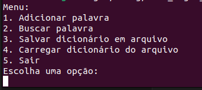
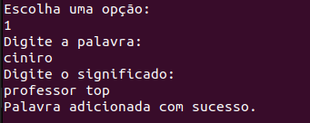
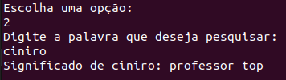
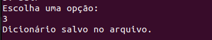

# Como compilar e rodar o código

## Compilação
Esse projeto foi desenvolvido utilizando a linguagem de programação Rust e o gerenciador de pacotes Cargo. Para compilar o projeto, é necessário ter instalado o Rust e o Cargo. Para instalar o Rust e o Cargo, siga as instruções do site oficial: https://www.rust-lang.org/tools/install

Após instalar o Rust e o Cargo, basta executar o comando `cargo build` na pasta raiz do projeto(neste caso '`.../trab_higor_gabriela`). O executável será gerado na pasta `target/debug/`. 

## Execução
Para executar o programa, basta executar o comando `cargo run` também na pasta raiz do projeto. Normalmente, o programa será executado com o arquivo de entrada `entrada.txt` e o arquivo de saída `saida.txt`. Neste caso já usamos o arquivo `dicionario.txt` automaticamente. 

### Durante a execução
Durante a execução, o programa irá imprimir um menu com as opções disponíveis, é **indispensável** que o usuário escolha a opção 4 para carregar o dicionário antes de realizar qualquer outra operação.

Após carregar o dicionário, o usuário pode escolher entre as opções:
- 1: Adicionar uma palavra

- 2: Buscar uma palavra

- 3: Salvar o dicionário

- 4: Carregar o dicionário (já explicado)
- 5: Sair do programa

## Resumo 
- Entre na pasta raiz do projeto e execute o comando `cargo build` para compilar o projeto.
- Execute o comando `cargo run` para executar o projeto.
- Durante a execução, escolha a opção 4 para carregar o dicionário.
- E pronto! Agora você pode adicionar, buscar e salvar palavras no dicionário.